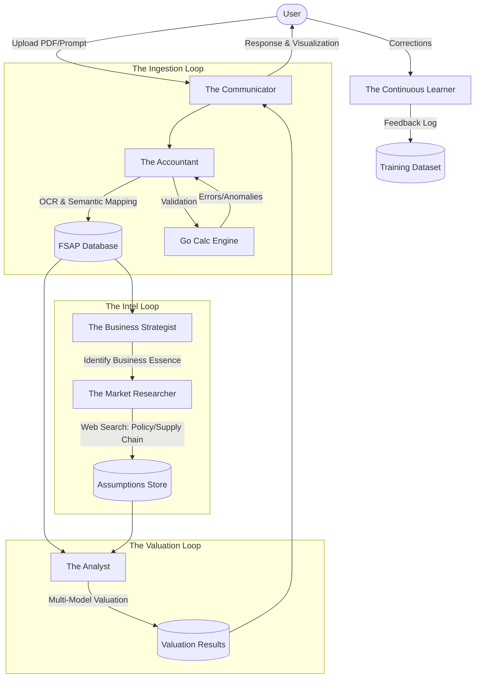

# Agentic Workflow & Role Definitions

The Agentic Valuation Platform utilizes a multi-agent system where specialized LLM-driven agents collaborate to transform raw financial reports into high-fidelity valuation models.

## 1. Agent Workflow Diagram

## 2. Agent Role Definitions

### 🏦 The Accountant
- **Primary Tool**: OCR, Semantic Mapping Engine.
- **Responsibility**: 
    - **10-K Initiation**: Establish the "Master Baseline" by parsing 3-5 years of historical data and full accounting policies.
    - **10-Q Maintenance**: Perform "Rolling TTM" updates and track incremental changes in inventory, AR, and debt.
    - **Semantic Mapping**: Map company-specific line items to standardized FSAP structures.
    - **Context Retrieval**: Extract and link corresponding "Notes" for context; fallback to 10-K definitions for 10-Q disclosures.
    - **Identity Guard**: Verify accounting identities (Assets = L + E).

### 📈 The Business Strategist
- **Primary Tool**: `fsap_business_essence` skill.
- **Responsibility**:
    - Identify the underlying business model (e.g., Asset Light vs. Heavy).
    - Analyze cost structures to identify "Key Drivers."
    - Highlight profitability anomalies based on industry benchmarks.

### 🌐 The Market Researcher
- **Primary Tool**: Web Search, Google News.
- **Responsibility**:
    - Track external policy changes (subsidies, tariffs).
    - Analyze supply chain impacts (raw material price fluctuations).
    - Provide evidence-based justification for WACC or Growth assumptions.

### 🧠 The Analyst
- **Primary Tool**: Valuation Models (DCF, Multiples, Residual Income).
- **Responsibility**:
    - **TTM + Forward Modeling**: Compute rolling Trailing Twelve Months and forecast forward EPS/FCF/EBITDA.
    - **Seasonality Adjustment**: Apply seasonal weighting for quarterly-driven industries.
    - **Perform complex financial reasoning**.
    - Run sensitivity analyses across different scenarios.
    - Synthesis all agent inputs into a final "Explainable" report.

### 💬 The Communicator
- **Primary Tool**: SSE Streaming Client, Chat Interface.
- **Responsibility**:
    - Orchestrate the entire workflow.
    - Present agentic "Thought Steps" in real-time.
    - Translate complex financial data into human-readable narratives.

### 🔄 The Continuous Learner
- **Primary Tool**: User Training Logs, RLHF Pipeline.
- **Responsibility**:
    - Watch for user corrections or overrides.
    - Capture the context of "human-in-the-loop" decisions.
    - Improve future mapping and assumption quality by learning from user behavior.

## 3. Communication Pattern
Agents communicate via a **Shared Context (PostgreSQL)** and notify the user via **SSE Streams** hosted by the Go backend. This ensures "Explainability" — the user always knows *which* agent made *what* decision and *why*.
