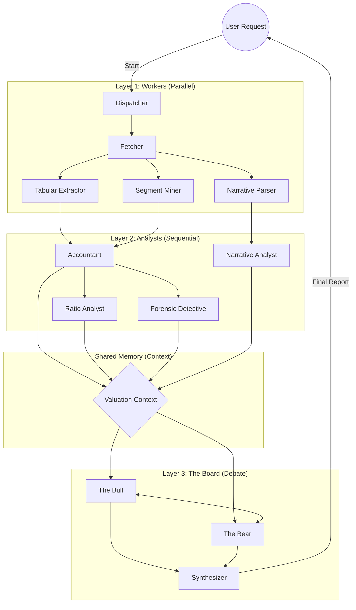

# TIED Agent 组织架构 (The Agent Hierarchy)

## 1. 核心理念 (Core Philosophy)
采用 **"分层架构 (Layered Architecture)"**。
下层 Agent 的**输出 (Output)** 是上层 Agent 的**上下文 (Context)**。
这就好比：初级分析师整理数据 -> 高级分析师写研报 -> 基金经理做决策。

## 2. 角色图谱 (Role Map)

### Layer 1: 数据采集与结构化 ("The Workers")
*负责：ETL, 清洗, 标准化*
*   **🕷️ Agent A1 - Filing Fetcher**: 
    *   **职能**: 监控 SEC，下载 HTML，切割文本。
    *   *Output*: Clean Markdown Files (Atomic).
*   **⛏️ Agent A2 - Tabular Extractor**: 
    *   **职能**: 从表格中提取 BS/IS/CF 数据，处理 OCR。
    *   *Output*: Raw JSON (Unmapped).
*   **🌍 Agent A3 - Segment Miner**: 
    *   **职能**: 专门扫描 "Note 25" 等附注，提取分部/地理数据。
    *   *Output*: Segment JSON.
*   **📝 Agent A4 - Narrative Parser**: 
    *   **职能**: 提取 MD&A, Risk Factors 文本段落，做简单的清洗。
    *   *Output*: Cleaned Text Blocks.

### Layer 2: 分析与洞察 ("The Analysts")
*负责：计算, 对比, 找异常*
*   **⚖️ Agent B1 - The Accountant (Standardizer)**: 
    *   **职能**: 运行 "Rolling Merger"，处理重述，把非标科目映射到标准科目 (Taxonomy Mapping)。
    *   *Output*: **Golden Data Series** (Consolidated Financials).
*   **📈 Agent B2 - Ratio Analyst**: 
    *   **职能**: 计算 RNOA, ROCE, Margin Trends, Common Size。
    *   *Output*: `AnalysisResult` struct.
*   **🕵️ Agent B3 - Forensic Detective**: 
    *   **职能**: 运行 Benford's Law, Beneish M-Score，寻找数字异常。
    *   *Output*: "Red Flags" List.
*   **📖 Agent B4 - Narrative Time-Traveler**: 
    *   **职能**: 对比三年的 MD&A，寻找关键词变化和语调偏移 (Sentiment Drift)。
    *   *Output*: "Narrative Shift Report" (e.g., "Shifted from Growth to Efficiency").
    
### Layer 2.5: 外部研究 ("The Scouts")
*负责：实时数据, 宏观背景, 市场情绪*
*   **🌍 Agent R1 - Macro Researcher**:
    *   **职能**: 使用 **Google Search** 搜索最新宏观经济数据 (GDP, 利率, 通胀) 和行业趋势。
    *   *Tools*: Google Search Grounding (via Gemini).
*   **📰 Agent R2 - Sentiment Researcher**:
    *   **职能**: 搜索最新的新闻头条、分析师研报摘要，评估市场情绪 (Bullish/Bearish)。
    *   *Tools*: Google Search Grounding (via Gemini).
*   **🏢 Agent R3 - Fundamental Researcher**:
    *   **职能**: 结合内部财务数据与外部市场信息，分析竞争格局和具体业务分部 (Segment Analysis)。
    *   *Tools*: Google Search Grounding (via Gemini).

### Layer 3: 推理与辩论 ("The Committee")
*负责：综合, 估值, 决策*
*   **🐂 Agent C1 - The Bull (多头)**:
    *   *Input*: Golden Data + Bullish Narratives.
    *   **职能**: 寻找增长点，构建乐观场景 (Optimistic Case)。
*   **🐻 Agent C2 - The Bear (空头)**:
    *   *Input*: Red Flags + Bearish Narratives.
    *   **职能**: 攻击增长假设，强调风险，构建悲观场景 (Pessimistic Case)。
*   **🧠 Agent C3 - The Synthesizer (PM)**:
    *   *Input*: Bull Case + Bear Case.
    *   **职能**: 权衡双方论点，给出**最终估值区间 (Valuation Range)**，并撰写投资备忘录 (Investment Memo)。

## 3. 协作流程 (Orchestration Flow)

## 4. 技术实现建议 (Tech Stack)
*   **Orchestrator**: 可以复用现有的 Go `agent.Manager`，但需要支持**DAG (有向无环图)** 任务编排。
*   **Context Passing**: 所有 Layer 2 的输出汇总成一个巨大的 Prompt Context (`Projected Context`)，喂给 Layer 3。

这个架构既保证了数据的严谨性（Layer 1 & 2），又保留了 AI 的创造性（Layer 3）。
